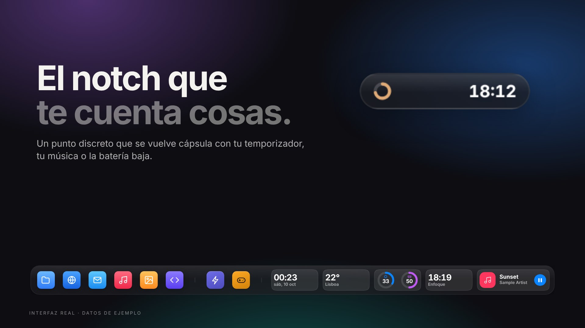
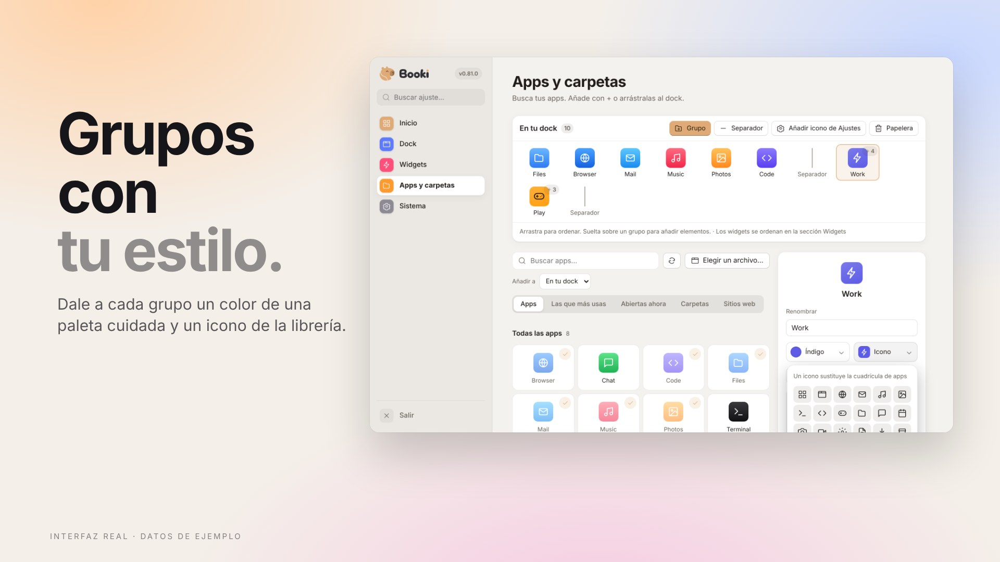

<p align="center">
  
</p>

<h1 align="center">Booki</h1>

<h3 align="center">Tu escritorio, más en calma.</h3>

<p align="center">Un dock precioso para Windows 11: apps, carpetas y widgets en vivo en una sola barra tranquila.<br/>Gratis, privado y de código abierto.</p>

<p align="center">
  <a href="https://github.com/punkable/booki/releases/latest"><b>Descargar para Windows</b></a> ·
  <a href="docs/releases/v0.82.0.md"><b>Novedades de 0.82</b></a> ·
  <a href="README.md">English</a>
</p>

<p align="center">
  <a href="https://github.com/punkable/booki/releases/latest"></a>
  
  
  <a href="LICENSE"></a>
</p>

<p align="center"></p>

<table align="center">
<tr>
<td align="center" width="25%"><b>⚡ Ligero</b><br/><sub>Núcleo nativo en Rust. Los widgets se pausan cuando el dock se oculta.</sub></td>
<td align="center" width="25%"><b>🔒 Privado</b><br/><sub>Sin cuentas, sin telemetría, sin nube.</sub></td>
<td align="center" width="25%"><b>🎨 Tuyo</b><br/><sub>Vidrio, Mica o sólido. Cualquier borde. Cinco idiomas.</sub></td>
<td align="center" width="25%"><b>🧡 Abierto</b><br/><sub>Licencia MIT. Hecho a la vista de todos.</sub></td>
</tr>
</table>

---

<h2 align="center">El notch que te cuenta cosas.</h2>

<p align="center">Un punto discreto arriba de la pantalla que se abre en cápsula con tu temporizador, la canción que suena o la batería baja.<br/>Pasa el ratón para ver una tarjeta con más. ¿Prefieres algo más simple? Elige pestaña pegada o píldora flotante.</p>

<p align="center"></p>

<h2 align="center">Grupos con tu estilo.</h2>

<p align="center">Ancla apps, carpetas, archivos y sitios web, y júntalos en grupos.<br/>Dale a cada grupo un color de una paleta cuidada y un icono de la librería: se ve en el dock y en Ajustes.</p>

<p align="center"></p>

<h2 align="center">En vivo, de un vistazo.</h2>

<p align="center">Reloj, calendario, clima, sistema (CPU, memoria, disco, red), batería, música, volumen, notas, portapapeles y enfoque (temporizador + tareas).<br/>Fichas compactas en la propia barra.</p>

<p align="center"></p>

<h2 align="center">Ajustes que da gusto usar.</h2>

<p align="center">Cinco páginas claras —Inicio, Dock, Widgets, Apps y Sistema— con una vista previa en vivo de tu dock y todo de un vistazo.</p>

<p align="center"></p>

<h2 align="center">Como en casa a oscuras.</h2>

<p align="center">Sigue el tema y el color de Windows. Vidrio desenfoca lo que hay detrás, Mica se tiñe con tu fondo y Sólido se mantiene nítido.<br/>Cuando un juego o vídeo pasa a pantalla completa, Booki se aparta.</p>

<p align="center"></p>

---

<h2 align="center">Privado por diseño.</h2>

<p align="center">Sin cuentas. Sin telemetría. Sin sincronización en la nube. Tus tareas, notas y uso se quedan en tu PC.<br/>El clima solo pide la ciudad que eliges, nunca tu ubicación.</p>

<p align="center"><sub>Las imágenes muestran la interfaz real de Booki 0.81 con datos y app de ejemplo.</sub></p>

## Instalar y empezar

1. Abre [Releases](https://github.com/punkable/booki/releases/latest) y elige `Booki_*_x64-setup.exe` (Intel/AMD) o `Booki_*_arm64-setup.exe` (Windows on ARM). También hay un MSI x64.
2. Abre **Booki** desde el menú Inicio. El instalador es por usuario y descarga WebView2 si falta.
3. Arrastra una app o carpeta al dock, o haz clic derecho en el dock para añadir elementos.

Requiere Windows 10 u 11. El instalador aún no tiene firma Authenticode, así que SmartScreen puede mostrar un aviso. Las actualizaciones se verifican y conservan tu configuración.

## Uso diario

| Acción | Resultado |
|---|---|
| Clic en un acceso | Abrirlo o enfocar su ventana |
| Arrastrar al dock | Anclarlo conservando el original |
| Arrastrar fuera | Desanclar, o devolver un acceso directo al escritorio |
| Clic derecho | Añadir elementos, cambiar perfil o abrir Ajustes |
| Clic central | Mostrar la ubicación en Explorer |
| `Alt` + `1…9` | Abrir el acceso correspondiente; modificador configurable |
| Cursor al borde | Revelar el dock si elegiste ese comportamiento |

## Privacidad

No hay cuentas, telemetría ni sincronización en la nube. La configuración y las recomendaciones de uso permanecen en tu equipo, en `%APPDATA%\Booki`. El portapapeles persistente está desactivado inicialmente y, al activarlo, se protege para tu usuario de Windows.

Las consultas de red se usan para actualizaciones y favicons, además del clima opcional mediante Open-Meteo al elegir una ciudad, sin pedir la ubicación del dispositivo. La desinstalación conserva los ajustes salvo que marques **Eliminar datos de la aplicación**.

## Desarrollo y soporte

Booki usa Tauri 2, Rust/Win32, JavaScript y React. Puedes previsualizar la interfaz en un navegador; las funciones nativas requieren Windows.

```bash
npm ci
npm run dev
npm run check:all
```

El [README en inglés](README.md) incluye instrucciones de compilación, auditoría de releases, donaciones y créditos. Las imágenes y el video se regeneran desde la interfaz real con [tools/presentation](tools/presentation/README.md).

Problemas: [GitHub Issues](https://github.com/punkable/booki/issues) o [punkable@protonmail.com](mailto:punkable@protonmail.com). Seguridad: [SECURITY.md](SECURITY.md).

Booki es libre y de código abierto, con licencia [MIT](LICENSE), creado por [Punkable](https://github.com/punkable). Se conservan las capturas anteriores y los originales de marca porque siguen siendo útiles.
