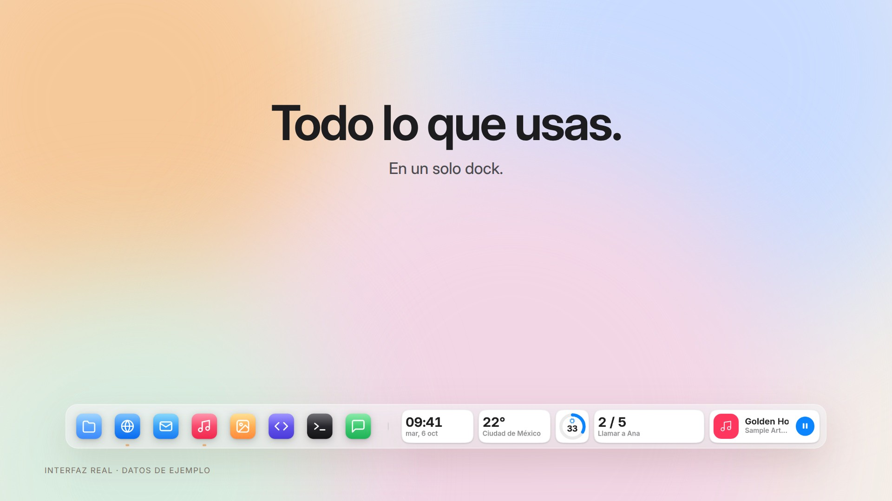
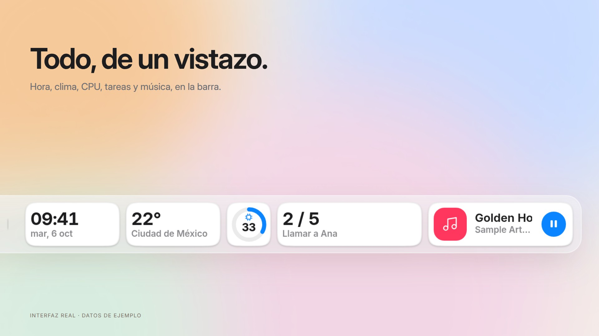
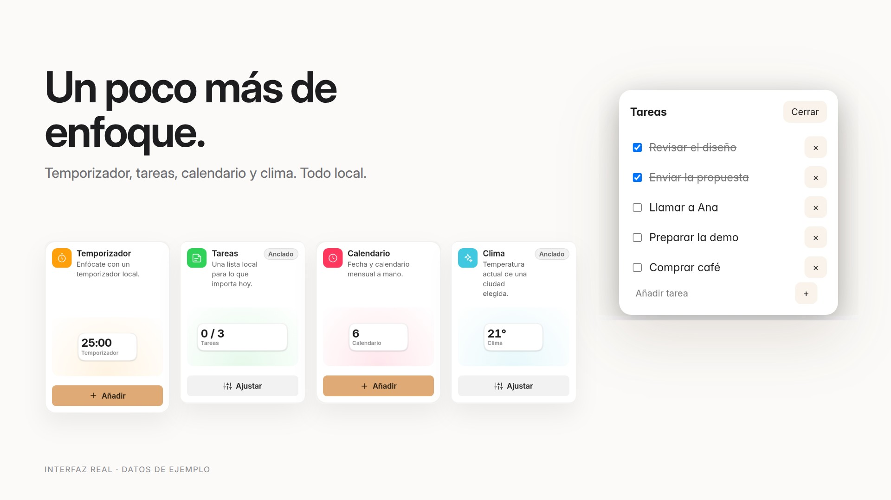
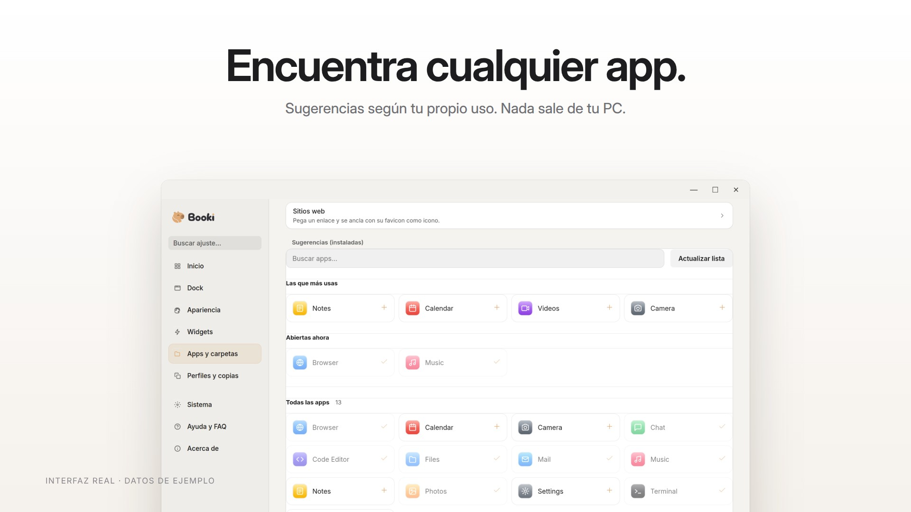
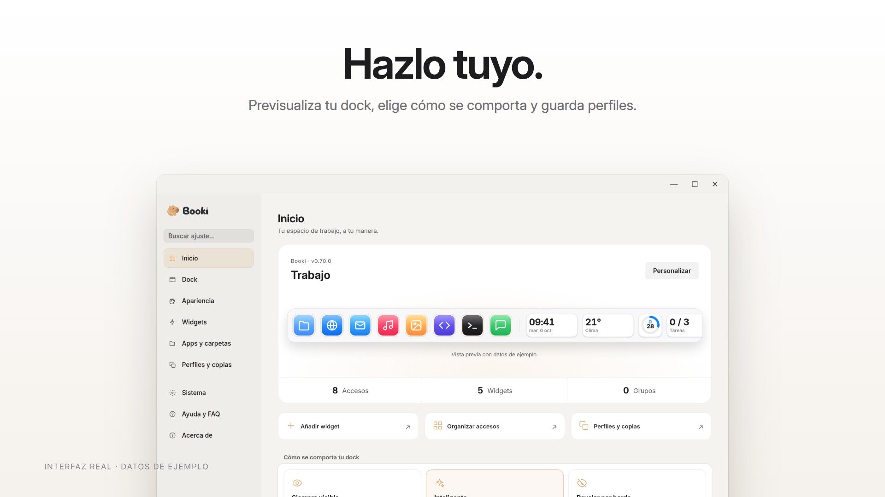
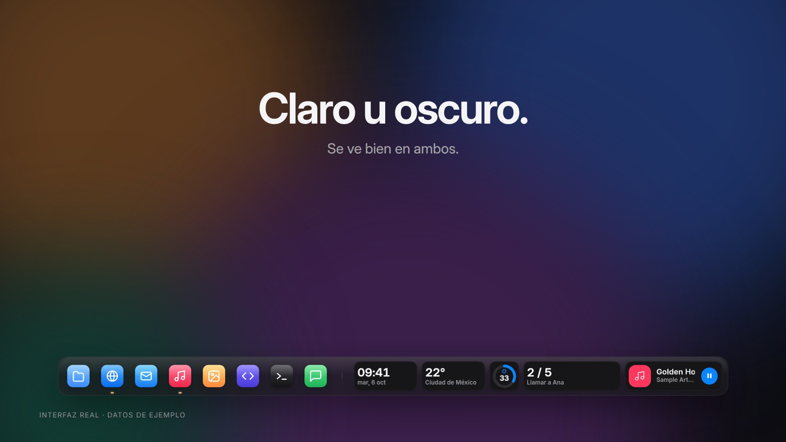

<p align="center">
  
</p>

<h1 align="center">Booki</h1>

<h3 align="center">Una forma más tranquila de usar Windows.</h3>

<p align="center">
  <a href="https://github.com/punkable/booki/releases/latest"><b>Descargar</b></a> ·
  <a href="docs/presentation/booki-070-es.mp4"><b>Ver el video</b></a> ·
  <a href="README.md">English</a>
</p>

<p align="center">
  <a href="docs/presentation/booki-070-es.mp4"></a>
</p>

---

<h2 align="center">Todo lo que usas. En un solo dock.</h2>

<p align="center">Ancla apps, carpetas, archivos y sitios web. Un clic para abrir o volver a una ventana que ya está abierta.<br/>Los clics fuera de la barra pasan directo a lo que hay detrás.</p>

<p align="center"></p>

<h2 align="center">Todo, de un vistazo.</h2>

<p align="center">Hora, clima, CPU, memoria, red, batería, notas, portapapeles y música: mosaicos compactos en la barra que se pausan cuando el dock se oculta.</p>

<p align="center"></p>

<h2 align="center">Un poco más de enfoque.</h2>

<p align="center">Temporizador, lista de tareas, calendario mensual y clima opcional por ciudad.<br/>Tus tareas se quedan en tu PC. El clima solo consulta la ciudad que eliges, nunca tu ubicación.</p>

<p align="center"></p>

<h2 align="center">Encuentra cualquier app.</h2>

<p align="center">Busca entre todo lo instalado, mira lo que está abierto y recibe sugerencias según tu propio uso.<br/>El uso se lee localmente de Windows y de lo que abres con Booki. Nada se sube.</p>

<p align="center"></p>

<h2 align="center">Hazlo tuyo.</h2>

<p align="center">Vista previa en vivo de tu dock, tres comportamientos (siempre visible, inteligente o revelar en el borde), perfiles, cualquier borde de la pantalla, vidrio o sólido y cinco idiomas.</p>

<p align="center"></p>

<h2 align="center">Claro u oscuro. Se ve bien en ambos.</h2>

<p align="center">Sigue el tema y el color de acento de Windows, con acrílico real detrás de la barra. Cuando un juego o video pasa a pantalla completa, Booki se aparta.</p>

---

<h2 align="center">Privado por diseño.</h2>

<p align="center">Sin cuentas. Sin telemetría. Sin nube. Código abierto con licencia MIT.</p>

<p align="center"><sub>Las imágenes y el video muestran la interfaz real de Booki con datos e iconos de ejemplo. Novedades en las <a href="docs/releases/v0.70.0.md">notas de 0.70</a>.</sub></p>

## Instalar y empezar

1. Abre [Releases](https://github.com/punkable/booki/releases/latest) y elige `Booki_*_x64-setup.exe` (Intel/AMD) o `Booki_*_arm64-setup.exe` (Windows on ARM). También hay un MSI x64.
2. Abre **Booki** desde el menú Inicio. El instalador es por usuario y descarga WebView2 si falta.
3. Arrastra una app o carpeta al dock, o haz clic derecho en el dock para añadir elementos.

Requiere Windows 10 u 11. El instalador aún no tiene firma Authenticode, así que SmartScreen puede mostrar un aviso. Las actualizaciones se verifican y conservan tu configuración.

## Uso diario

| Acción | Resultado |
|---|---|
| Clic en un acceso | Abrirlo o enfocar su ventana |
| Arrastrar al dock | Anclarlo conservando el original |
| Arrastrar fuera | Desanclar; 0.70 ofrece además devolver accesos directos al escritorio |
| Clic derecho | Añadir elementos, cambiar perfil o abrir Ajustes |
| Clic central | Mostrar la ubicación en Explorer |
| `Alt` + `1…9` | Abrir el acceso correspondiente; modificador configurable |
| Cursor al borde | Revelar el dock si elegiste ese comportamiento |

## Privacidad

No hay cuentas, telemetría ni sincronización en la nube. La configuración y las recomendaciones de uso permanecen en tu equipo, en `%APPDATA%\Booki`. El portapapeles persistente está desactivado inicialmente y, al activarlo, se protege para tu usuario de Windows.

Las consultas de red se usan para actualizaciones y favicons; 0.70 añade clima opcional mediante Open-Meteo al elegir una ciudad, sin pedir la ubicación del dispositivo. La desinstalación conserva los ajustes salvo que marques **Eliminar datos de la aplicación**.

## Desarrollo y soporte

Booki usa Tauri 2, Rust/Win32, JavaScript y React. Puedes previsualizar la interfaz en un navegador; las funciones nativas requieren Windows.

```bash
npm ci
npm run dev
npm run check:all
```

El [README en inglés](README.md) incluye instrucciones de compilación, auditoría de releases, donaciones y créditos. Las imágenes y el video se regeneran desde la interfaz real con [tools/presentation](tools/presentation/README.md).

Problemas: [GitHub Issues](https://github.com/punkable/booki/issues) o [punkable@protonmail.com](mailto:punkable@protonmail.com). Seguridad: [SECURITY.md](SECURITY.md).

Booki es libre y de código abierto, con licencia [MIT](LICENSE), creado por [Punkable](https://github.com/punkable). Se conservan las capturas anteriores y los originales de marca porque siguen siendo útiles.
