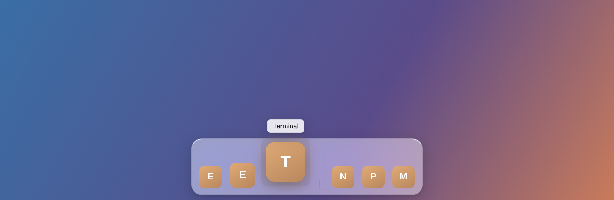
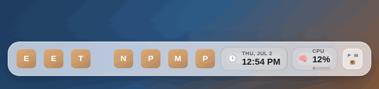
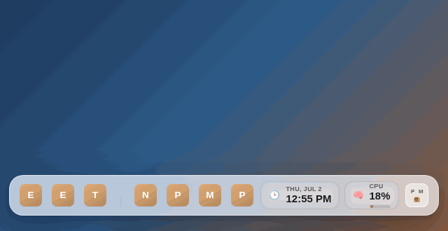
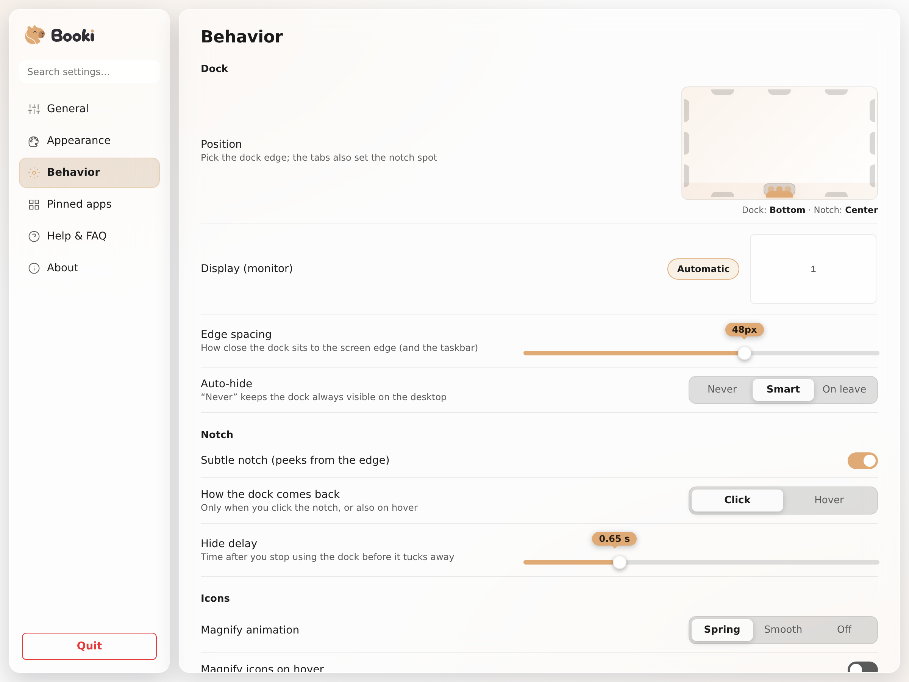
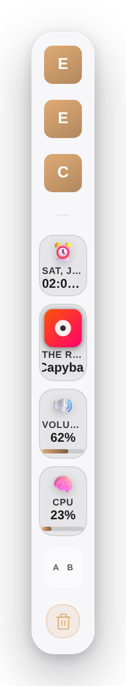

<h1 align="center">Booki</h1>

<p align="center">
  <b>Smart dock for Windows.</b><br/>
  A polished glass dock for apps, folders, files, live widgets, clipboard history and a floating notch.
</p>

<p align="center">
  
</p>

<p align="center">
  <a href="https://github.com/punkable/booki/releases/latest"></a>
  <a href="https://github.com/punkable/booki/releases"></a>
  <a href="#gallery"></a>
</p>

<p align="center">
  <a href="https://github.com/punkable/booki/releases/latest"></a>
  <a href="https://github.com/punkable/booki/releases"></a>
  
  
  <a href="LICENSE"></a>
</p>

---

## ✨ What makes it feel good

| | |
|---|---|
| 🚀 **A dock, not a taskbar** | Pin apps, folders, files, pictures and websites. Click to launch, or focus an already-open window. Right-click a pin for recent files; icons bounce as they open. |
| 🧩 **Everything can be arranged** | Drag from the desktop to pin, drag out to unpin, drop on the bin to delete, group apps and widgets, and reorder directly on the bar. |
| 🎛️ **Live widgets that stay aligned** | CPU/RAM/disk/battery/volume ring gauges, clock, network, uptime, notes, clipboard history and now-playing controls live in compact cards that do not stretch the dock. Widgets can be tuned from Settings. |
| 🫥 **Smart hide + floating notch** | The dock tucks away into a slim notch and comes back when you ask for it. It also stays out of fullscreen games and videos. |
| 🎯 **Precise interaction** | The transparent window leaves room for shadows and flyouts, but clicks outside the painted dock pass through to the app behind it. |
| 🎨 **Designed to fit Windows** | Light/dark/system themes, wallpaper-aware accent, translucent glass, size/spacing/radius controls, multi-monitor support and six languages. |
| 🔒 **Private by design** | No accounts, no telemetry, no cloud sync. Your setup stays local in `%APPDATA%\Booki`, with clipboard memory opt-in and local-only controls. |
| 🪶 **Small and native** | Tauri 2 + Rust on the system WebView2 runtime: a small installer and timers that pause when the dock is hidden. |

## Beta 0.49.11 highlights

- **Dock context menus redesigned:** right-click menus now use a native Windows
  rhythm with a clear header, grouped actions, quieter icons and separated
  destructive choices.
- **Calmer media marquee:** long song/video titles scroll at a stable,
  distance-aware speed instead of racing when metadata refreshes.
- **More native typography:** dock, menus, widgets and Settings lean harder on
  Segoe UI Variable, with Spanish accents/ñ and menu labels cleaned up.

## Beta 0.49.10 highlights

- **Clearer context menus:** dock and Settings menus use consistent icon wells,
  safer danger styling, readable widget labels and better edge clamping.
- **Cleaner type hierarchy:** menus, Settings sections, widget cards and pinned
  app rows now share a tighter typography scale.

## Beta 0.49.9 highlights

- **Quiet smart-hide for creative apps:** in click mode, Booki no longer
  auto-reveals just because a floating panel or dialog briefly uncovers the
  dock area.
- **Fullscreen restore is calmer:** if the dock was hidden before fullscreen,
  it returns to the notch after fullscreen and waits for your click.

## Beta 0.49.8 highlights

- **Notch reveal fixed:** clicking the notch now brings the dock to the front
  reliably, using the same Tauri window APIs across the app instead of a brittle
  extra native raise call.
- **Cleaner Mica dock:** outer shadows were removed from the dock/notch so the
  surface feels calmer and no longer needs a wide transparent click area.
- **Update pill placement:** the update badge stays next to the dock instead of
  drifting into the middle of the stage window.
- **Smarter smart-hide:** hide/show decisions use the dock's real screen rect,
  reducing unwanted appearances while switching between windows.
- **Simpler General settings:** the confusing always-on-top toggle is no longer
  exposed; Booki manages that internally so the notch remains dependable.

## Beta 0.49.6 highlights

- **Settings visual overhaul**: clearer hierarchy, calmer Mica-style surfaces,
  stronger sections and fewer generic AI-looking panels.
- **Quick themes with more intent**: accent colors and presets now have richer
  previews so the choice reads visually before you click.
- **Pinned apps are easier to scan**: list/grid controls, action buttons and
  folder rows are more legible in narrow Settings windows.
- **Dock and popups reviewed responsively**: menus, flyouts, modals, notch and
  the update pill stay inside the viewport on compact sizes.
- **Better interaction targets**: drag handles, close buttons and quick actions
  are larger, keyboard-labeled and respond with subtle motion.

## Beta 0.49.4 highlights

- **Widget gallery:** Settings now shows native widgets like a small catalog. You can see what is pinned, add missing widgets, and tune widget-specific behavior without hunting through generic controls.
- **Media wheel volume:** the Media widget can optionally use the mouse wheel for system volume only while the pointer is over that widget.
- **Clipboard history that explains itself:** search, favorites, session-only entries, compact mode, retention limits and protected restart memory are all in one local privacy panel.
- **Capture visibility:** choose whether Booki appears in compatible screenshots, recordings and screen shares.
- **More responsive UI:** Settings, dock flyouts and clipboard rows adapt better to narrow windows, vertical docks and long copied text.

<a id="gallery"></a>

## 🖼️ Gallery

<table>
  <tr>
    <td width="50%" align="center">
      <br/>
      <sub><b>Smart hide</b> — the bar genies into the notch when you start working.</sub>
    </td>
    <td width="50%" align="center">
      <br/>
      <sub><b>Folders</b> — group pins and open them in a glass flyout.</sub>
    </td>
  </tr>
  <tr>
    <td align="center">
      <br/>
      <sub><b>Settings</b> — live preview, visual pickers, searchable.</sub>
    </td>
    <td align="center">
      <br/>
      <sub><b>Any edge</b> — a slim vertical column on the sides, widgets and all.</sub>
    </td>
  </tr>
</table>

<p align="center">
  <br/>
  <sub>The <em>notch</em>: a little glass tab that stays blended into the taskbar edge while the dock is away.</sub>
</p>

## 🚀 Install

1. Download the latest installer from [**Releases**](https://github.com/punkable/booki/releases/latest) —
   `Booki_*_x64-setup.exe` (per-user, no admin needed).
2. Run it and launch **Booki** from the Start menu. The dock appears at the bottom
   of the screen; a tray icon gives you show/hide, settings and quit.

> **Requires Windows 10/11** — the WebView2 runtime is fetched automatically if missing.
>
> 🛡️ **SmartScreen note:** this beta isn't signed with a commercial certificate yet, so
> Windows may show *"Windows protected your PC"* — choose **More info → Run anyway**.

## ⌨️ Handy gestures

| Gesture | Action |
|---------|--------|
| Click a pin | Launch it (or focus its window) |
| Drag from the desktop → dock | Pin an app, folder, file or picture |
| Drag a pin out of the dock | Unpin it |
| **Middle-click** a pin | Open its location in Explorer |
| Right-click the dock | Add apps / widgets / profiles / settings |
| Double-click a widget | Jump to its style editor |
| Mouse wheel over Media (optional) | Raise or lower system volume |
| `Alt` + `1…9` | Launch the Nth pin (modifier is configurable) |
| Push cursor into the screen edge | Reveal a hidden dock |

## 🔒 Privacy & security

- Booki runs **fully offline** except for: checking GitHub for updates (signed
  releases), and — only if you pin a website — fetching its favicon. **No
  telemetry, no accounts, no data collection.**
- Everything is stored locally in `%APPDATA%\Booki\config.json`.
- Clipboard history is local. Restart memory is **off by default**; when enabled
  it is protected for your Windows user, can auto-expire after a chosen number
  of days, and supports session-only entries that are never written to disk.
- Booki is hidden from compatible captures by default; Settings lets you choose
  whether the dock/notch should appear in screenshots, recordings and screen
  shares.
- **Updates** are delivered in-app: Booki checks the latest GitHub release,
  downloads the **signed** installer, updates itself in place for your user and
  **keeps your settings**. You can also check manually in *Settings → About*.
- "Start with Windows" writes a single per-user registry entry
  (`HKCU\…\Run\Booki`); the uninstaller removes the app's data folders.
- Deletions from the dock's trash go to the Recycle Bin. If Defender's
  *Controlled folder access* blocks one, allow Booki in Windows Security →
  Ransomware protection — it's a false alarm, Booki never bypasses the bin.

## 💛 A free project, made with love

Booki is **free and open source** (MIT), made with care by
**[Punkable](https://github.com/punkable)** ([@0xPunki](https://x.com/0xPunki) on X).
Built with [Tauri 2](https://tauri.app) + Rust, and developed with the help of
AI tooling ([Claude Code](https://claude.com/claude-code)) under human direction and testing.

If it makes your desktop nicer and you'd like to support development, donations
are welcome — totally optional, thank you 🙏

| | Network | Address |
|---|---------|---------|
|  | **Bitcoin** | `bc1pltth9wcqnctc2nqa6he6puqpqs83a2rdkxhyk8gk53uvk6v2mnustsq7t3` |
|  | **Solana** | `JCRkiVEm5sPBNnna1j16CRu5E4VeNWtoj6TThxmVFB4W` |

Questions, ideas or bug reports? Email **[punkable@protonmail.com](mailto:punkable@protonmail.com)**
or open an issue — see [SECURITY.md](SECURITY.md) for reporting vulnerabilities.

## 🛠️ Tech stack

| Layer    | Tech                                                               |
| -------- | ------------------------------------------------------------------ |
| Shell    | [Tauri 2](https://tauri.app) (system WebView2 — no bundled Chromium) |
| Backend  | Rust + [`windows`](https://crates.io/crates/windows) (Win32 / WinRT) |
| Frontend | Vanilla-JS dock + React settings, bundled with Vite                 |
| Art      | [Fluent Emoji](https://github.com/microsoft/fluentui-emoji) 3D (Microsoft, MIT) |

## 👩‍💻 Development

> Booki is a Windows app; on Linux/macOS you can preview the UI in a browser —
> the frontend ships demo data when the Tauri bridge is absent.

```bash
npm install
npm run dev          # browser preview with mock data → http://localhost:1420
npm run tauri:dev    # the real app (Windows, Rust toolchain + WebView2)
npm run tauri:build  # build the NSIS installer (.exe)
```

Releases are built and signed by CI on every version bump pushed to `main`
([`.github/workflows/release.yml`](.github/workflows/release.yml)); older
releases are pruned so only the latest stays downloadable.

## 📄 License

MIT — do whatever makes you happy, credit is appreciated. 🦫

<sub>Emoji artwork: [Fluent Emoji](https://github.com/microsoft/fluentui-emoji) © Microsoft, MIT license.</sub>

<p align="center">
  <br/>
  <sub>Made with 🧡 by <a href="https://github.com/punkable">Punkable</a> · <a href="https://x.com/0xPunki">@0xPunki</a></sub>
</p>
