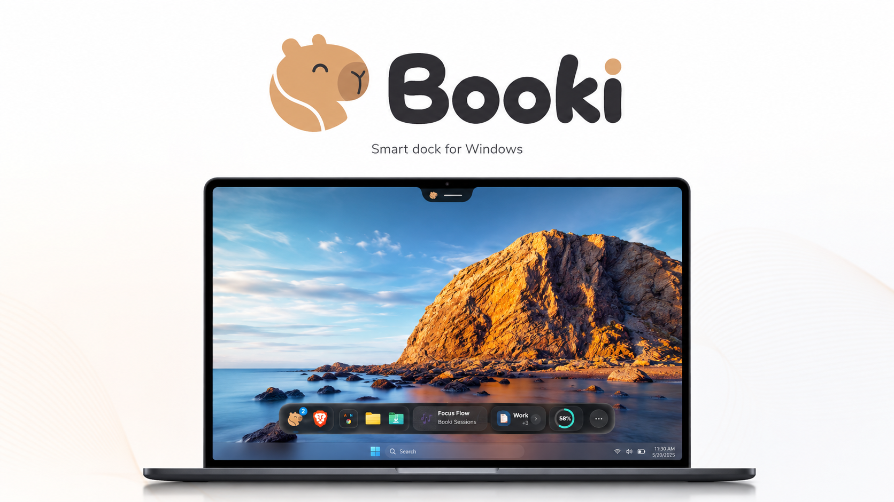
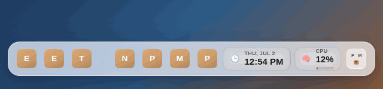
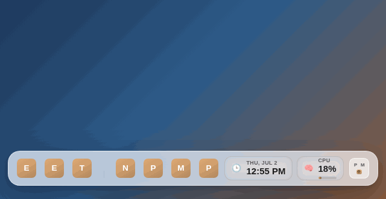

<p align="center">
  
</p>

<h1 align="center">Booki</h1>

<p align="center">Your apps, folders and widgets. A calmer workspace on Windows.</p>

<p align="center">
  <a href="https://github.com/punkable/booki/releases/latest">Download the current release</a> ·
  <a href="#preview-the-next-booki">Preview 0.70</a> ·
  <a href="README.es.md">Español</a>
</p>

<p align="center">
  <a href="https://github.com/punkable/booki/releases/latest"></a>
  
  <a href="LICENSE"></a>
</p>

**Release status:** the published installer is **0.69.0**. The **0.70 overhaul is an unreleased preview** in [PR #75](https://github.com/punkable/booki/pull/75). The preview images and film below show that upcoming version with example data. They are not a promise that the latest download already contains those changes.

## Install and get started

1. Open [Releases](https://github.com/punkable/booki/releases/latest). Choose `Booki_*_x64-setup.exe` for Intel/AMD Windows, or `Booki_*_arm64-setup.exe` for Windows on ARM. An x64 MSI is also available.
2. Install and launch **Booki** from the Start menu. The standard installer is per-user; WebView2 is fetched if missing.
3. Drag an app or folder onto the dock, or right-click the dock to add items. Open Settings from its menu or tray icon.

Windows 10/11 is required. The beta installer is not Authenticode-signed: Windows may show a SmartScreen warning. Updater signatures verify downloaded update files; they do not remove SmartScreen warnings. In-app updates preserve your configuration.

## What Booki does

| Use it for | How it works |
|---|---|
| **Your daily apps** | Pin apps, folders, files, images and websites. Click to launch; optionally focus an existing window. Right-click for app/window actions and recent files. |
| **Useful information** | Clock, CPU/RAM/disk/battery, network, uptime, volume, notes, clipboard history and now-playing widgets. |
| **Room to work** | Smart hiding moves the dock out of the way. A small notch keeps it reachable; fullscreen behavior is configurable. |
| **Your layout** | Any screen edge, groups, custom icons, light/dark/system themes, glass or solid surfaces, sizing and spacing. |
| **Your settings** | Local configuration, named profiles, JSON backup/import and five interface languages. No account or cloud sync. |

Clicks outside the painted dock pass through to the window behind it. Widget rendering pauses while hidden to avoid unnecessary updates.

<details>
<summary>See native Windows captures from 0.69</summary>

<p align="center"></p>

<table>
  <tr>
    <td align="center"><br/>Smart hide</td>
    <td align="center"><br/>Folder flyouts</td>
  </tr>
</table>

These earlier captures are kept as useful reference material. The 0.70 presentation below is rendered from the new frontend, rather than recorded on Windows hardware.

</details>

## Preview the next Booki

<p align="center">
  <a href="docs/presentation/booki-070-preview-en.mp4"></a>
</p>

**[Watch the 30-second preview](docs/presentation/booki-070-preview-en.mp4)** · [Spanish edition](docs/presentation/booki-070-preview-es.mp4) · [Text captions](docs/presentation/booki-070-preview-en.vtt)

The film is silent, with explanations on screen. It uses actual Booki UI, sample app/usage data and the official logo. Native materials and Windows behavior still need testing on Windows.

<table>
  <tr>
    <td width="50%"><br/><b>Make it yours.</b> Shared dock previews, behavior scenarios, profiles and grouped responsive settings.</td>
    <td width="50%"><br/><b>Find your apps.</b> Search installed apps, browse running apps and see suggestions based on local usage.</td>
  </tr>
  <tr>
    <td><br/><b>Useful at a glance.</b> A visual gallery, adjustable widths and four new widgets: timer, tasks, calendar and optional city weather.</td>
    <td><br/><b>A better dock.</b><br/><br/>Scroll crowded layouts or adapt their size. Reduce transparency. Recover conditionally hidden widgets. Edit your layout with a visible mode and a Done action.</td>
  </tr>
</table>

The same update includes the fixes from [#64](https://github.com/punkable/booki/issues/64):

- Pinning keeps originals. Explicit shortcut moves preserve `.lnk` contents and avoid overwriting files; dragging out offers return to desktop, unpin or cancel.
- Show Desktop signals reveal a smart-hidden dock, including with the click trigger. Manual hiding stays manual.
- Folder pagination reaches all entries; language changes refresh widget labels and menus; cancelling a drag keeps items in place.
- Partial configuration writes preserve unrelated changes, native polling avoids overlap, and diagnostics omit personal widget content and paths.
- Installer language support, startup cleanup, updater progress and release history are improved.

Read the complete [0.70 notes](docs/releases/v0.70.0.md). Automated frontend/Rust checks, native Windows regression tests and x64/ARM64 packaging passed for the overhaul. Interactive Win+D, monitor/DPI changes and a real install/update cycle remain required before publication. ARM64 packaging is not an ARM64 runtime test.

## Everyday controls

| Action | Result |
|---|---|
| Click a pin | Launch it or focus its window |
| Drag desktop → dock | Pin an app, folder, file or image; ordinary pinning preserves the original |
| Drag a pin out | Unpin; 0.70 additionally offers an explicit desktop-return action for shortcuts |
| Right-click the dock | Add items, choose a profile or open Settings |
| Middle-click a pin | Reveal its location in Explorer |
| Double-click a widget | Open its configuration; utility widgets in 0.70 also open their own panel |
| `Alt` + `1…9` | Launch the corresponding pin; the modifier is configurable |
| Push the cursor to the edge | Reveal a hidden dock when edge/hover behavior is enabled |
| Wheel over Media, if enabled | Change system volume |

## Privacy and your data

- No telemetry, accounts or cloud synchronization. Configuration lives at `%APPDATA%\Booki\config.json`, with a safety backup.
- Network requests are limited to update checks/downloads and website favicons; 0.70 adds optional Open-Meteo weather after choosing a city, without device-location access.
- 0.70 app recommendations read Windows' local usage record and local successful Booki launches (`app-usage.json`). Usage is not uploaded.
- Clipboard history is local. Restart persistence is off by default; when enabled, it is protected for your Windows user and can expire.
- Compatible captures hide the dock by default. Enable **Visible in captures** in Settings when recording it.
- Uninstall preserves settings unless you select **Delete app data**. Normal uninstall removes the startup entry and Explorer shell actions.

## Support

Booki is free and open source (MIT), by **[Punkable](https://github.com/punkable)** ([@0xPunki](https://x.com/0xPunki)).

Donations are optional:

| | Network | Address |
|---|---------|---------|
|  | **Bitcoin** | `bc1pltth9wcqnctc2nqa6he6puqpqs83a2rdkxhyk8gk53uvk6v2mnustsq7t3` |
|  | **Solana** | `JCRkiVEm5sPBNnna1j16CRu5E4VeNWtoj6TThxmVFB4W` |

Questions or bugs: **[punkable@protonmail.com](mailto:punkable@protonmail.com)** or open an issue. See [SECURITY.md](SECURITY.md) for vulnerabilities.

## Development

Booki uses Tauri 2, Rust/Win32, a vanilla JavaScript dock and React settings, built with Vite. Linux/macOS can preview the frontend with sample data; native behavior requires Windows and WebView2.

```bash
npm ci
npm run dev          # browser preview at http://localhost:1420
npm run check:all    # contracts, build and functional tests
npm run tauri:dev    # native app on Windows with Rust installed
npm run tauri:build  # Windows packages
```

For the presentation, see [tools/presentation](tools/presentation/README.md). Remotion, source scenes and generated fixtures are isolated from the app; finished media live in `docs/presentation/`. Useful historical screenshots and PNG brand exports are retained in `docs/`, outside the shipped assets.

To audit the current public release without running its installers:

```bash
node scripts/audit-release.mjs /absolute/path/to/release-audit
```

This downloads the public assets, checks GitHub hashes, verifies updater signatures using Booki's configured public key, and validates the manifest and installer containers. It does not verify Windows runtime behavior or Authenticode.

Releases are built from version tags through [release.yml](.github/workflows/release.yml). Publishing requires the complete signed updater asset set and matching versions. The workflow uploads and re-downloads the draft assets for integrity checks before publication, preserving older releases for rollback.

## License and credits

[MIT](LICENSE). Booki by [Punkable](https://github.com/punkable) · [@0xPunki](https://x.com/0xPunki).

Emoji artwork: [Fluent Emoji](https://github.com/microsoft/fluentui-emoji) © Microsoft, MIT. Optional city weather: [Open-Meteo](https://open-meteo.com/). The presentation uses the official Booki logo and no third-party music.
