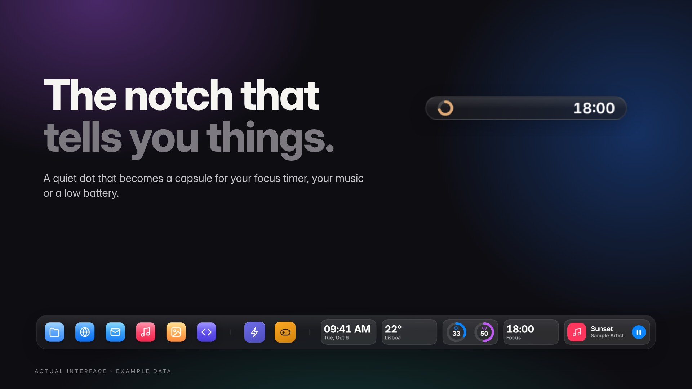
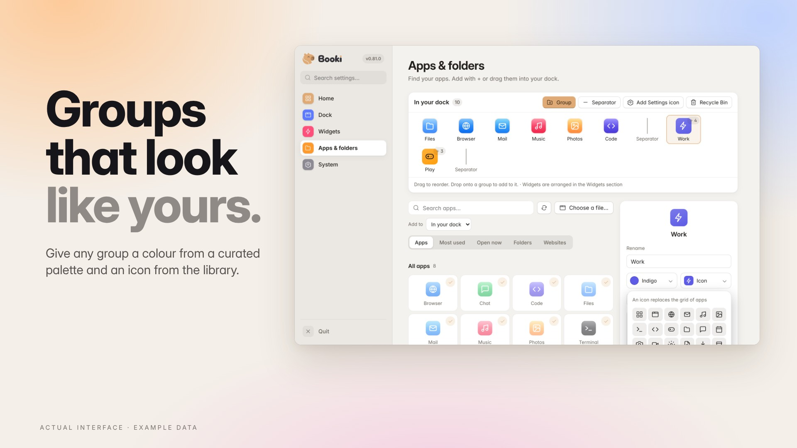

<p align="center">
  
</p>

<h1 align="center">Booki</h1>

<h3 align="center">Your desktop, calmer.</h3>

<p align="center">A beautiful dock for Windows 11 — apps, folders and live widgets in one calm bar.<br/>Free, private and open source.</p>

<p align="center">
  <a href="https://github.com/punkable/booki/releases/latest"><b>Download for Windows</b></a> ·
  <a href="docs/releases/v0.82.0.md"><b>What's new in 0.82</b></a> ·
  <a href="README.es.md">Español</a>
</p>

<p align="center">
  <a href="https://github.com/punkable/booki/releases/latest"></a>
  
  
  <a href="LICENSE"></a>
</p>

<p align="center"></p>

<table align="center">
<tr>
<td align="center" width="25%"><b>⚡ Light</b><br/><sub>Native Rust core. Widgets pause when the dock hides.</sub></td>
<td align="center" width="25%"><b>🔒 Private</b><br/><sub>No accounts, no telemetry, no cloud.</sub></td>
<td align="center" width="25%"><b>🎨 Yours</b><br/><sub>Glass, Mica or solid. Any edge. Five languages.</sub></td>
<td align="center" width="25%"><b>🧡 Open</b><br/><sub>MIT licensed. Built in the open.</sub></td>
</tr>
</table>

---

<h2 align="center">The notch that tells you things.</h2>

<p align="center">A quiet dot at the top of your screen that opens into a capsule for your focus timer, the song that's playing or a low battery.<br/>Hover it for a card with more. Prefer something simpler? Choose an attached tab or a floating pill.</p>

<p align="center"></p>

<h2 align="center">Groups that look like yours.</h2>

<p align="center">Pin apps, folders, files and websites, then gather them into groups.<br/>Give each group a colour from a curated palette and an icon from the library — it shows in the dock and in Settings.</p>

<p align="center"></p>

<h2 align="center">Live, at a glance.</h2>

<p align="center">Clock, calendar, weather, system (CPU, memory, disk, network), battery, media, volume, notes, clipboard and focus (timer + tasks).<br/>Compact tiles that sit right on the bar.</p>

<p align="center"></p>

<h2 align="center">Settings you actually enjoy.</h2>

<p align="center">Five clear pages — Home, Dock, Widgets, Apps and System — with a live preview of your dock and everything at a glance.</p>

<p align="center"></p>

<h2 align="center">At home in the dark.</h2>

<p align="center">Follows your Windows theme and accent. Glass blurs what's behind it, Mica tints with your wallpaper, Solid stays crisp.<br/>When a game or video goes fullscreen, Booki steps aside.</p>

<p align="center"></p>

---

<h2 align="center">Private by design.</h2>

<p align="center">No accounts. No telemetry. No cloud sync. Your tasks, notes and usage stay on your PC.<br/>Weather asks only for the city you choose — never your location.</p>

<p align="center"><sub>Images show the actual Booki 0.81 interface with example data and generic sample icons.</sub></p>

## Get started

1. Open [Releases](https://github.com/punkable/booki/releases/latest) and pick `Booki_*_x64-setup.exe` (Intel/AMD) or `Booki_*_arm64-setup.exe` (Windows on ARM). An x64 MSI is also available.
2. Launch **Booki** from the Start menu. The installer is per-user and fetches WebView2 if it's missing.
3. Drag an app or folder onto the dock, or right-click the dock to add items.

Booki needs Windows 10 or 11. The installer isn't Authenticode-signed yet, so SmartScreen may warn you. Updates are signature-checked and keep your settings. The new background updater applies to the registered per-user setup installation; MSI/portable copies should use the same installer type from Releases.

### New in 0.82

- **Open apps, not new copies** — clicking an open app goes to its window; clicking the one in front minimizes it.
- **Quick launcher** — Ctrl+Alt+Space searches apps, folders and open windows.
- **A notch that steps aside** — it hides over maximized apps and comes back when you reach for it.
- **Easier groups** — drop an app across the middle of another, and drag apps in and out of groups in Settings.
- **Weather forecast and new panels**, plus automatic profiles by monitor or schedule.

See the [complete 0.82 release notes](docs/releases/v0.82.0.md), [0.81](docs/releases/v0.81.0.md) and the [0.80 overhaul](docs/releases/v0.80.0.md).

## Everyday controls

| Action | Result |
|---|---|
| Click a pin | Launch it or focus its window |
| Drag desktop → dock | Pin an app, folder, file or image; ordinary pinning preserves the original |
| Drag a pin out | Unpin, or return a shortcut to the desktop |
| Right-click the dock | Add items, choose a profile or open Settings |
| Middle-click a pin | Reveal its location in Explorer |
| Double-click a widget | Open its configuration; utility widgets open their own panel |
| `Alt` + `1…9` | Launch the corresponding pin; the modifier is configurable |
| Push the cursor to the edge | Reveal a hidden dock when edge/hover behavior is enabled |
| Wheel over Media, if enabled | Change system volume |

## Privacy and your data

- No telemetry, accounts or cloud synchronization. Configuration lives at `%APPDATA%\Booki\config.json`, with a safety backup.
- Network requests are limited to update checks/downloads and website favicons, plus optional Open-Meteo weather after choosing a city, without device-location access.
- App recommendations read Windows' local usage record and local successful Booki launches (`app-usage.json`). Usage is not uploaded.
- Clipboard history is local. Restart persistence is off by default; when enabled, it is protected for your Windows user and can expire.
- Compatible captures hide the dock by default. Enable **Visible in captures** in Settings when recording it.
- Uninstall preserves settings unless you select **Delete app data**. Normal uninstall removes the startup entry and Explorer shell actions.

## Support

Booki is free and open source (MIT), by **[Punkable](https://github.com/punkable)** ([@0xPunki](https://x.com/0xPunki)).

Donations are optional:

| | Network | Address |
|---|---------|---------|
|  | **Bitcoin** | `bc1pltth9wcqnctc2nqa6he6puqpqs83a2rdkxhyk8gk53uvk6v2mnustsq7t3` |
|  | **Solana** | `JCRkiVEm5sPBNnna1j16CRu5E4VeNWtoj6TThxmVFB4W` |

Questions or bugs: **[punkable@protonmail.com](mailto:punkable@protonmail.com)** or open an issue. See [SECURITY.md](SECURITY.md) for vulnerabilities.

## Development

Booki uses Tauri 2, Rust/Win32, a vanilla JavaScript dock and React settings, built with Vite. Linux/macOS can preview the frontend with sample data; native behavior requires Windows and WebView2.

```bash
npm ci
npm run dev          # browser preview at http://localhost:1420
npm run check:all    # contracts, build and functional tests
npm run tauri:dev    # native app on Windows with Rust installed
npm run tauri:build  # Windows packages
```

The images and film are rebuilt from the real frontend by [tools/presentation](tools/presentation/README.md); finished media live in `docs/presentation/`. Older native Windows captures and PNG brand exports are kept in `docs/`.

To audit the current public release without running its installers:

```bash
node scripts/audit-release.mjs /absolute/path/to/release-audit
```

This downloads the public assets, checks GitHub hashes, verifies updater signatures using Booki's configured public key, and validates the manifest and installer containers. It does not verify Windows runtime behavior or Authenticode.

Releases are built from version tags through [release.yml](.github/workflows/release.yml). Publishing requires the complete signed updater asset set and matching versions. The workflow uploads and re-downloads the draft assets for integrity checks before publication, preserving older releases for rollback.

## License and credits

[MIT](LICENSE). Booki by [Punkable](https://github.com/punkable) · [@0xPunki](https://x.com/0xPunki).

Emoji artwork: [Fluent Emoji](https://github.com/microsoft/fluentui-emoji) © Microsoft, MIT. Optional city weather: [Open-Meteo](https://open-meteo.com/). The presentation uses the official Booki logo, [Inter](tools/presentation/fonts/OFL.txt) under the SIL Open Font License, and no third-party music. See the [visual identity guidelines](docs/brand/README.md).

### Quality and design

See the [CoolDock research and design decisions](docs/research/cooldock.md) and [premium workspace implementation, measurements and verification limits](docs/quality/premium-workspace.md).
