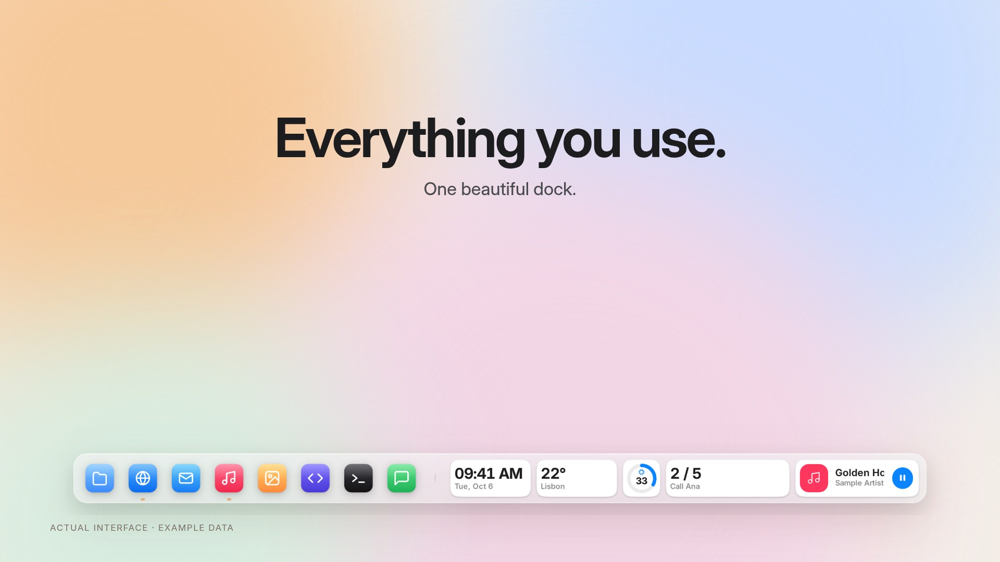
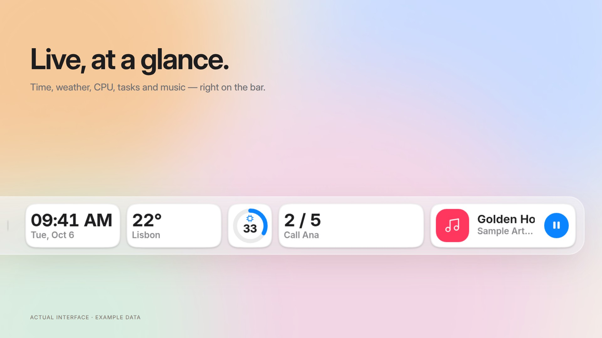
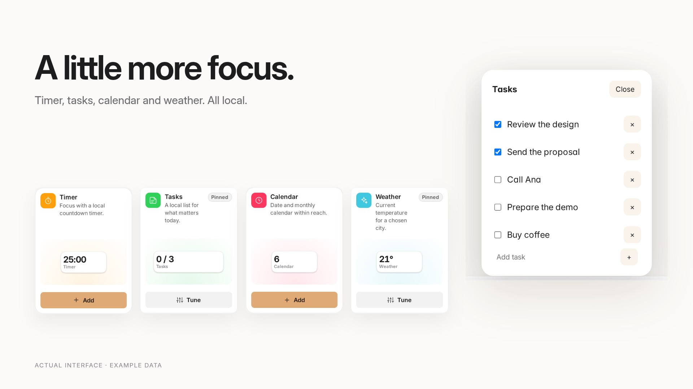
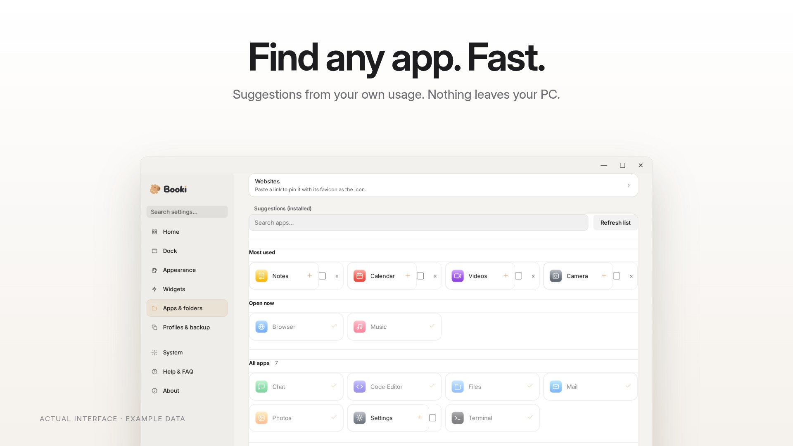
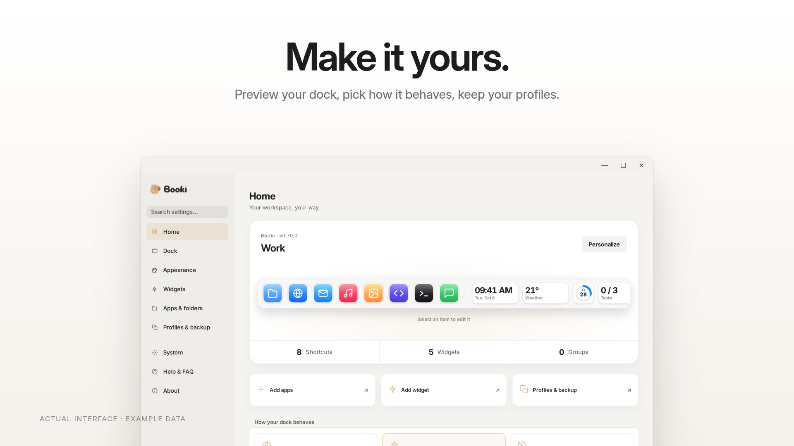
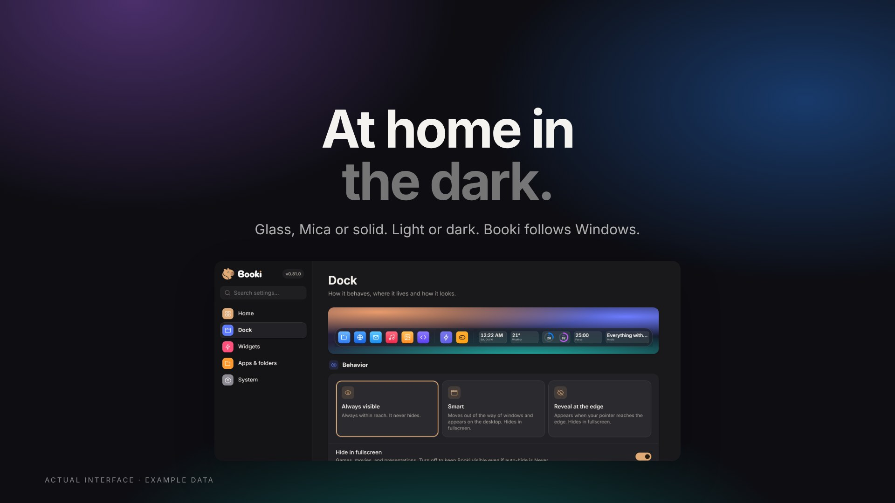

<p align="center">
  
</p>

<h1 align="center">Booki</h1>

<h3 align="center">A calmer way to use Windows.</h3>

<p align="center">
  <a href="https://github.com/punkable/booki/releases/latest"><b>Download</b></a> ·
  <a href="docs/presentation/booki-070-en.mp4"><b>Watch the film</b></a> ·
  <a href="README.es.md">Español</a>
</p>

<p align="center">
  <a href="https://github.com/punkable/booki/releases/latest"></a>
  
  <a href="LICENSE"></a>
</p>

<p align="center">
  <a href="docs/presentation/booki-070-en.mp4"></a>
</p>

---

<h2 align="center">Everything you use. One beautiful dock.</h2>

<p align="center">Pin apps, folders, files and websites. Click to launch, or jump back to a window that's already open.<br/>Clicks outside the bar go straight through to whatever is behind it.</p>

<p align="center"></p>

<h2 align="center">Live, at a glance.</h2>

<p align="center">Time, weather, CPU, memory, network, battery, notes, clipboard and now playing — compact tiles that sit right on the bar and pause when the dock is hidden.</p>

<p align="center"></p>

<h2 align="center">A little more focus.</h2>

<p align="center">A countdown timer, a task list, a monthly calendar and optional city weather.<br/>Your tasks stay on your PC. Weather asks only for the city you choose — never your location.</p>

<p align="center"></p>

<h2 align="center">Find any app. Fast.</h2>

<p align="center">Search everything installed, see what's open, and get suggestions from your own usage.<br/>Usage is read locally from Windows and from launches through Booki. Nothing is uploaded.</p>

<p align="center"></p>

<h2 align="center">Make it yours.</h2>

<p align="center">A live preview of your dock, three behaviors to choose from — always visible, smart, or reveal at the edge — named profiles, any screen edge, glass or solid surfaces, and five languages.</p>

<p align="center"></p>

<h2 align="center">Light or dark. At home in either.</h2>

<p align="center">Follows your Windows theme and wallpaper accent, with optional native desktop blur behind the bar. When a game or video goes fullscreen, Booki steps aside.</p>

---

<h2 align="center">Private by design.</h2>

<p align="center">No accounts. No telemetry. No cloud sync. Open source under MIT.</p>

<p align="center"><sub>Images and film show the actual Booki interface with example data and generic sample app icons. The presentation shows the 0.70 overhaul. See the <a href="docs/releases/v0.70.2.md">0.70.2 surface and usability fixes</a>.</sub></p>

## Get started

1. Open [Releases](https://github.com/punkable/booki/releases/latest) and pick `Booki_*_x64-setup.exe` (Intel/AMD) or `Booki_*_arm64-setup.exe` (Windows on ARM). An x64 MSI is also available.
2. Launch **Booki** from the Start menu. The installer is per-user and fetches WebView2 if it's missing.
3. Drag an app or folder onto the dock, or right-click the dock to add items.

Booki needs Windows 10 or 11. The installer isn't Authenticode-signed yet, so SmartScreen may warn you. Updates are signature-checked and keep your settings. The new background updater applies to the registered per-user setup installation; MSI/portable copies should use the same installer type from Releases.

> Download the latest published version using the release badge above. Booki checks the same release channel for updates; existing clients keep their current update interface for the first upgrade to 0.70.

### New in 0.70

- New Home dashboard in Settings, a visual widget gallery, adjustable widget widths and reduced transparency.
- Four new widgets: timer, tasks, calendar and optional city weather (Open-Meteo).
- A redesigned app library with search, running apps and local usage suggestions.
- Fixes from [#64](https://github.com/punkable/booki/issues/64): pinning keeps your original shortcuts, dragging out can return a shortcut to the desktop, folders show every entry, smart hide responds to Show Desktop, and changing language refreshes widgets and menus.
- Safer configuration writes, a privacy-respecting diagnostics export, steadier updates and a fully translated installer.

## Everyday controls

| Action | Result |
|---|---|
| Click a pin | Launch it or focus its window |
| Drag desktop → dock | Pin an app, folder, file or image; ordinary pinning preserves the original |
| Drag a pin out | Unpin; 0.70 additionally offers an explicit desktop-return action for shortcuts |
| Right-click the dock | Add items, choose a profile or open Settings |
| Middle-click a pin | Reveal its location in Explorer |
| Double-click a widget | Open its configuration; utility widgets in 0.70 also open their own panel |
| `Alt` + `1…9` | Launch the corresponding pin; the modifier is configurable |
| Push the cursor to the edge | Reveal a hidden dock when edge/hover behavior is enabled |
| Wheel over Media, if enabled | Change system volume |

## Privacy and your data

- No telemetry, accounts or cloud synchronization. Configuration lives at `%APPDATA%\Booki\config.json`, with a safety backup.
- Network requests are limited to update checks/downloads and website favicons; 0.70 adds optional Open-Meteo weather after choosing a city, without device-location access.
- 0.70 app recommendations read Windows' local usage record and local successful Booki launches (`app-usage.json`). Usage is not uploaded.
- Clipboard history is local. Restart persistence is off by default; when enabled, it is protected for your Windows user and can expire.
- Compatible captures hide the dock by default. Enable **Visible in captures** in Settings when recording it.
- Uninstall preserves settings unless you select **Delete app data**. Normal uninstall removes the startup entry and Explorer shell actions.

## Support

Booki is free and open source (MIT), by **[Punkable](https://github.com/punkable)** ([@0xPunki](https://x.com/0xPunki)).

Donations are optional:

| | Network | Address |
|---|---------|---------|
|  | **Bitcoin** | `bc1pltth9wcqnctc2nqa6he6puqpqs83a2rdkxhyk8gk53uvk6v2mnustsq7t3` |
|  | **Solana** | `JCRkiVEm5sPBNnna1j16CRu5E4VeNWtoj6TThxmVFB4W` |

Questions or bugs: **[punkable@protonmail.com](mailto:punkable@protonmail.com)** or open an issue. See [SECURITY.md](SECURITY.md) for vulnerabilities.

## Development

Booki uses Tauri 2, Rust/Win32, a vanilla JavaScript dock and React settings, built with Vite. Linux/macOS can preview the frontend with sample data; native behavior requires Windows and WebView2.

```bash
npm ci
npm run dev          # browser preview at http://localhost:1420
npm run check:all    # contracts, build and functional tests
npm run tauri:dev    # native app on Windows with Rust installed
npm run tauri:build  # Windows packages
```

The images and film are rebuilt from the real frontend by [tools/presentation](tools/presentation/README.md); finished media live in `docs/presentation/`. Older native Windows captures and PNG brand exports are kept in `docs/`.

To audit the current public release without running its installers:

```bash
node scripts/audit-release.mjs /absolute/path/to/release-audit
```

This downloads the public assets, checks GitHub hashes, verifies updater signatures using Booki's configured public key, and validates the manifest and installer containers. It does not verify Windows runtime behavior or Authenticode.

Releases are built from version tags through [release.yml](.github/workflows/release.yml). Publishing requires the complete signed updater asset set and matching versions. The workflow uploads and re-downloads the draft assets for integrity checks before publication, preserving older releases for rollback.

## License and credits

[MIT](LICENSE). Booki by [Punkable](https://github.com/punkable) · [@0xPunki](https://x.com/0xPunki).

Emoji artwork: [Fluent Emoji](https://github.com/microsoft/fluentui-emoji) © Microsoft, MIT. Optional city weather: [Open-Meteo](https://open-meteo.com/). The presentation uses the official Booki logo, [Inter](tools/presentation/fonts/OFL.txt) under the SIL Open Font License, and no third-party music. See the [visual identity guidelines](docs/brand/README.md).

### Quality and design

See the [CoolDock research and design decisions](docs/research/cooldock.md) and [premium workspace implementation, measurements and verification limits](docs/quality/premium-workspace.md).
